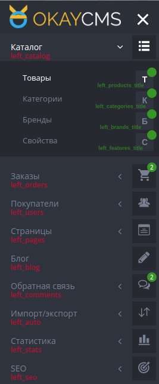
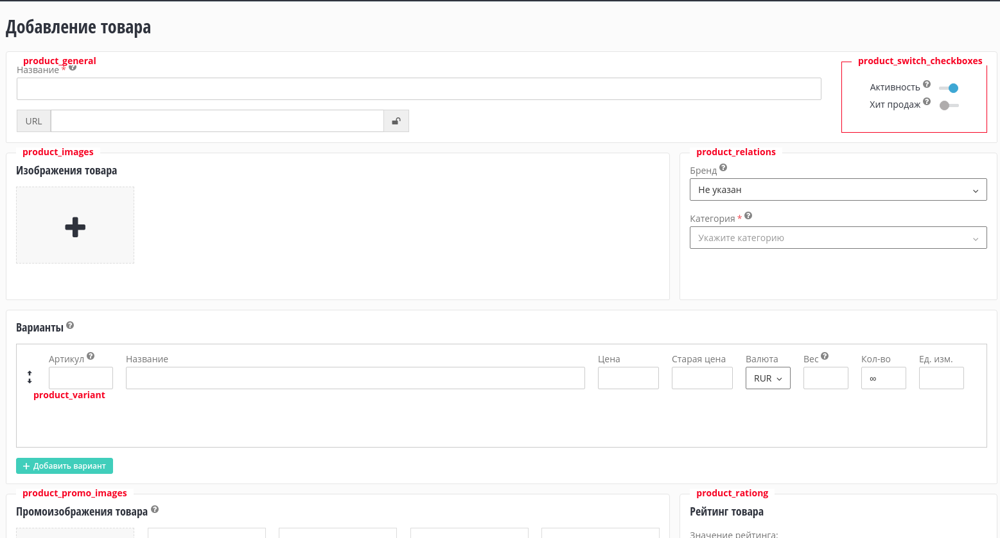

# Режим разработчика

#### Меню админ-части

Для добавления пункта меню в админ-панеле, нужно воспользоваться методом 
[extendBackendMenu()](./modules/init.md#extendBackendMenu), 
Чтобы посмотреть существующие группы меню, нужно включить режим разработчика, и в админ-части к группам меню будет 
добавлено, красным цветом, название группы.

Также в меню можно добавлять счётчики новых событий. Для этого нужно использовать зелёное название счетчика для
пункта меню и воспользоваться методом [ManagerMenu::addCounter()](./core/ManagerMenu.md#addCounter)

#### Шорт-блоки

Шорт-блоки в OkayCMS нужны чтобы модули могли вставлять туда свой HTML код. Админ-панель размечена шорт-блоками,
название которых всегда уникально. Модули добавляющие свою вёрстку в блок, всегда добавляют её в конец блока.
Если несколько модулей добавляется в один и тот же блок, они добавляются последовательно, как они расположены
в разделе модулей.

Также несколько блоков (но их очень ограниченое количество) есть в клиентской части сайта.

Чтобы просмотреть доступные шорт-блоки, нужно включить режим разработчика, и перейти в админ-панель сайта.
Будет видно красные надписи, при наведении на которые, будет подсвечиваться граница блока.

Чтобы добавить шорт-блок, нужно воспользоваться методом [Init::addBackendBlock()](./modules/init.md#addBackendBlock) или
[Init::addFrontBlock()](./modules/init.md#addFrontBlock).

